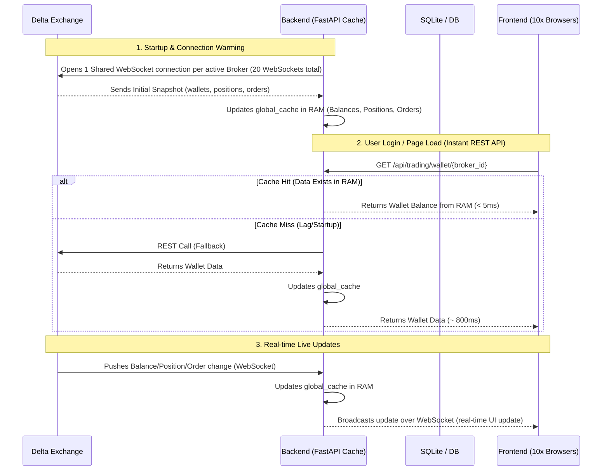

# bitcos_poc
multiple account handling

pip install gunicorn

sudo nano /etc/systemd/system/fastapi.service
[Unit]
Description=FastAPI Application
After=network.target

[Service]
User=ubuntu
Group=ubuntu
WorkingDirectory=/home/ubuntu/bitcos_poc
Environment="PATH=/home/ubuntu/venv/bin"

ExecStart=/home/ubuntu/venv/bin/gunicorn app.main:app -k uvicorn.workers.UvicornWorker --workers 2 --bind 127.0.0.1:8000

Restart=always

[Install]
WantedBy=multi-user.target

sudo systemctl daemon-reload
sudo systemctl reset-failed fastapi

sudo systemctl start fastapi
sudo systemctl status fastapi

sudo apt update
sudo apt install nginx -y

sudo systemctl status nginx

sudo nano /etc/nginx/sites-available/fastapi

server {
    listen 80;
    server_name _;

    location / {
        proxy_pass http://127.0.0.1:8000;

        proxy_set_header Host $host;
        proxy_set_header X-Real-IP $remote_addr;
        proxy_set_header X-Forwarded-For $proxy_add_x_forwarded_for;
        proxy_set_header X-Forwarded-Proto $scheme;
    }

    # WebSocket Support for FastAPI
    location /api/ws/ {
        proxy_pass http://127.0.0.1:8000;
        proxy_http_version 1.1;
        proxy_set_header Upgrade $http_upgrade;
        proxy_set_header Connection "upgrade";
        
        proxy_set_header Host $host;
        proxy_set_header X-Real-IP $remote_addr;
        proxy_set_header X-Forwarded-For $proxy_add_x_forwarded_for;
        proxy_set_header X-Forwarded-Proto $scheme;
    }
}

sudo ln -s /etc/nginx/sites-available/fastapi /etc/nginx/sites-enabled/

sudo rm /etc/nginx/sites-enabled/default

sudo nginx -t
sudo systemctl restart nginx
sudo systemctl status nginx

#### daily deployment command ########

cd ~/bitcos_poc

git pull origin main

source ~/venv/bin/activate

pip install -r requirements.txt
sudo systemctl daemon-reload
# gunicorn service
sudo systemctl restart fastapi   
sudo systemctl status fastapi 
# nginx service
sudo nginx -t
sudo systemctl restart nginx

<!-- {
  "broker_name": "Delta Exchange",
  "broker_login_id": "delta01",
  "api_key": "zS1jowZhVOMzQGCUyYvz0iwtfUJY0J",
  "secret_key": "gAAAAABprAiMdhaZ9zoxrusZaSudllzjjXq-v7NueSPXC7LmfhiiwX23nLTyIX8iQDSAAYZjqo8lyL4T2srY0LtB7h9XmWLaaIaak_OGJaZ-Rx_IVPwN-yN_WLgdtVqkT6wEffCxIs-6W0NVAcg6kjxYN20Ir5M4jw==",
  "totp_secret": "m7PCO2FNhg9So8Q6o0JIbG8NhHb7vJ6ICdmKXuewjsacfxgWW36oC0ByvePV",
  "name_tag": "ankit-account",
  "redirect_url": "https://api.india.delta.exchange"
} -->

## Option A: Memory Caching & WebSocket Architecture

To solve rate limits (HTTP 429) and network latency, we use a **Memory Caching & WebSocket Architecture**.

### 1. Connection & Data Flow Diagram

### 2. Key Architecture Points

1. **No REST Calls on Login:** When a user logs in, the backend *does not* hit the Delta Exchange REST API. Instead, it reads the data from `global_cache` which is kept hot and updated by the persistent WebSocket background tasks.
2. **Initial Snapshot via WebSocket:** Delta Exchange's private WebSocket channels (`wallets`, `positions`, `orders`) automatically push the **initial snapshot** of all account data as soon as the connection is established. This means the cache is warmed up automatically without needing initial REST API requests.
3. **Fallback REST Call:** If a REST API request comes in and the cache is somehow empty, the backend executes a single fallback REST call to Delta Exchange, warms up the cache, and serves the response. Subsequent requests from any browser will hit the cache.
4. **Latency Reduction:** Read queries drop from `~1000ms` (network call) to `< 5ms` (RAM lookup).
5. **Rate-Limit Prevention:** Serves 10+ browser windows concurrently without increasing outbound network requests to Delta Exchange.

